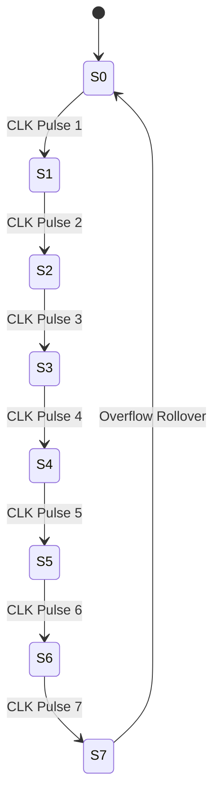
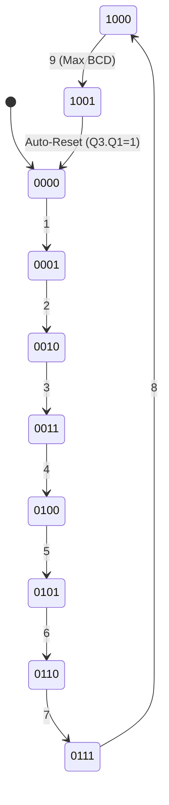

# Digital Logic Design: Counters & Finite State Machines (FSMs)

<div align="center">

[](https://www.xilinx.com/)
[](https://www.xilinx.com/)
[](https://www.xilinx.com/)
[](https://www.xilinx.com/)
[](#architectural-comparison-of-counter-types)

</div>

> [!TIP]
> **Repository Overview**: This repository provides a complete, industrial-grade digital design suite for **Asynchronous Ripple Counters**, **High-Speed Synchronous Counters**, **Truncated MOD-10 (Decade / BCD) Counters**, and **Bidirectional Up/Down Counters**. Implemented using both gate-level schematic capture and synthesizeable Verilog HDL within **Xilinx ISE Design Suite (vP.20131013)** targeting Spartan-3A, Spartan-6, and Artix-7 FPGAs, this library serves as the central state-generation and event-counting engine in the digital design continuum.

---

## Table of Contents

1. [Architectural Continuum: State Generation in the Digital Stack](#architectural-continuum-state-generation-in-the-digital-stack)
2. [Project Directory & Module Manifest](#project-directory--module-manifest)
3. [Theoretical Foundations of Digital Counters](#theoretical-foundations-of-digital-counters)
   * [Asynchronous (Ripple) vs. Synchronous Clocking Mechanics](#asynchronous-ripple-vs-synchronous-clocking-mechanics)
   * [Cumulative Propagation Delay & Maximum Frequency Limits](#cumulative-propagation-delay--maximum-frequency-limits)
   * [Decoding Glitches & Transient Hazard Analysis](#decoding-glitches--transient-hazard-analysis)
4. [Modulo Arithmetic & Truncated Decade Counting](#modulo-arithmetic--truncated-decade-counting)
   * [MOD-10 (Decade / BCD) Truncation Mechanics ($1010_2 \rightarrow 0000_2$)](#mod-10-decade--bcd-truncation-mechanics)
   * [Asynchronous Glitch Reset vs. Synchronous Load Clear](#asynchronous-glitch-reset-vs-synchronous-load-clear)
   * [Cascaded Multi-Decade Frequency Division & BCD Generation](#cascaded-multi-decade-frequency-division--bcd-generation)
5. [Bidirectional Up/Down Mode-Steered Counting](#bidirectional-updown-mode-steered-counting)
6. [Module Deep-Dives & FSM State Transition Diagrams](#module-deep-dives--fsm-state-transition-diagrams)
   * [`01_Asynchronus_Counter`: Cascaded Ripple Counters](#01-asynchronous-ripple-counters)
   * [`02_Synchronus_Counter`: Parallel Master Clock Counters](#02-synchronous-counters)
   * [`03_MOD_10_Counter`: 4-Bit BCD Decade Counter](#03-mod-10-decade--bcd-counter)
   * [`04_Ripple_Counter`: 3-Bit Bidirectional Up/Down Counter](#04-3-bit-updown-ripple-counter)
7. [Synthesizeable Verilog HDL Reference Suite](#synthesizeable-verilog-hdl-reference-suite)
8. [FPGA Deployment, UCF Constraints & Pin Mapping](#fpga-deployment-ucf-constraints--pin-mapping)
9. [EDA Toolchain, Verification & ISim Workflow](#eda-toolchain-verification--isim-workflow)

---

## Architectural Continuum: State Generation in the Digital Stack

Digital counters bridge low-level sequential memory storage ([Sequential-Logic-Architecture](file:///c:/Users/himan/OneDrive/Documents/GitHub/Sequential-Logic-Architecture/README.md)) with arithmetic processing units and visual display interfaces ([Display-Drivers](file:///c:/Users/himan/OneDrive/Documents/GitHub/Display-Drivers/README.md)).

```
+---------------------------------------------------------------------------------------------------------+
|                                    DIGITAL SYSTEM DATA CONTINUUM                                        |
+---------------------------------------------------------------------------------------------------------+
|                                                                                                         |
|  +---------------------------+       +---------------------------+       +---------------------------+  |
|  | Sequential Architecture   |       | Digital Counters & FSMs   |       | Display Driver Subsystem  |  |
|  | [Sequential-Logic-Arch]   | ----> | [THIS REPOSITORY]         | ----> | [Display-Drivers]         |  |
|  | - SR / MSJK / D / T FFs   |       | - 3-Bit Async & Sync      |       | - BCD -> 7-Seg (abcdefg)  |  |
|  | - SISO/SIPO/PISO/PIPO     |       | - MOD-10 BCD Decade FSM   |       | - 2-Bit TDM Scan Driver   |  |
|  +---------------------------+       +---------------------------+       +---------------------------+  |
|               |                                    |                                   |                |
|       [1-Bit Memory Cells]               [Cyclic State Generators]             [Human-Readable Output]  |
+---------------------------------------------------------------------------------------------------------+
```

* **Inputs**: Driven by single-bit T/D Flip-Flops and clock prescalers.
* **Outputs**: Generates cyclic multi-bit binary states ($Q[N-1:0]$) and 4-bit BCD nibbles ($0000_2 - 1001_2$) that feed directly into 7-Segment Decoders (`abcdefg.sch`).

---

## Project Directory & Module Manifest

| Module Directory | Primary Circuit Design | Clocking Architecture | Key Hardware Feature | Module Documentation |
| :--- | :--- | :--- | :--- | :--- |
| **[`01_Asynchronus_Counter`](file:///c:/Users/himan/OneDrive/Documents/GitHub/Counters-and-FSms/01_Asynchronus_Counter/README.md)** | 3-Bit Async Up/Down & Ripple | Cascaded Clock Chain | Minimal gate complexity, $\div 2^N$ frequency prescaling | [Read Module](file:///c:/Users/himan/OneDrive/Documents/GitHub/Counters-and-FSms/01_Asynchronus_Counter/README.md) |
| **[`02_Synchronus_Counter`](file:///c:/Users/himan/OneDrive/Documents/GitHub/Counters-and-FSms/02_Synchronus_Counter/README.md)** | 3-Bit Synchronous Up Counter | Shared Master Clock | Simultaneous state transitions, zero cumulative ripple delay | [Read Module](file:///c:/Users/himan/OneDrive/Documents/GitHub/Counters-and-FSms/02_Synchronus_Counter/README.md) |
| **[`03_MOD_10_Counter`](file:///c:/Users/himan/OneDrive/Documents/GitHub/Counters-and-FSms/03_MOD_10_Counter/README.md)** | 4-Bit MOD-10 Decade / BCD | Truncated Reset Feedback | Automatic feedback reset ($Q_3 \cdot Q_1 = 1$) at state $1010_2$ | [Read Module](file:///c:/Users/himan/OneDrive/Documents/GitHub/Counters-and-FSms/03_MOD_10_Counter/README.md) |
| **[`04_Ripple_Counter`](file:///c:/Users/himan/OneDrive/Documents/GitHub/Counters-and-FSms/04_Ripple_Counter/README.md)** | 3-Bit Bidirectional Up/Down | Mode-Steered Clock Net | AND-OR multiplexer steers $Q$ or $\bar{Q}$ via Mode line $M$ | [Read Module](file:///c:/Users/himan/OneDrive/Documents/GitHub/Counters-and-FSms/04_Ripple_Counter/README.md) |

---

## Theoretical Foundations of Digital Counters

### Asynchronous (Ripple) vs. Synchronous Clocking Mechanics

```
1. ASYNCHRONOUS (RIPPLE) COUNTER:
   CLK ---> [TFF 0] ---> Q0 (Clocks FF1) ---> [TFF 1] ---> Q1 (Clocks FF2) ---> [TFF 2]
   * Cumulative propagation delay accumulates across stages: N * t_pd.

2. SYNCHRONOUS COUNTER:
   CLK --------------------+------------------------+
                           |                        |
   CLK ---> [TFF 0]        +-------> [TFF 1]        +-------> [TFF 2]
               ^                        ^                        ^
               |                        |                        |
             (T=1)                   (T=Q0)                  (T=Q0*Q1)
   * All flip-flops trigger simultaneously on the exact same master clock edge.
```

$$\begin{array}{l|c|c|c|c}
\mathbf{Counter\ Class} & \mathbf{Clocking\ Method} & \mathbf{Max\ Frequency\ (f_{\text{max}})} & \mathbf{Propagation\ Delay\ (\Delta t)} & \mathbf{Primary\ Application} \\
\hline
\textbf{Asynchronous Ripple} & \text{Cascaded Output } (Q_i \rightarrow \text{CLK}_{i+1}) & \text{Lower } \left(\frac{1}{N \cdot t_{\text{pd}}}\right) & \mathcal{O}(N \cdot t_{\text{pd}})\text{ (Accumulates)} & \text{Frequency prescalers, low-power dividers} \\
\textbf{Synchronous Counter} & \text{Shared Master Clock Line} & \text{High } \left(\frac{1}{t_{\text{cq}} + t_{\text{comb}} + t_{\text{su}}}\right) & \mathcal{O}(t_{\text{cq}} + t_{\text{comb}})\text{ (Constant)} & \text{High-speed state machines, CPU pipelines} \\
\textbf{MOD-10 Decade} & \text{Truncated Feedback Gating} & \text{Moderate } \left(\frac{1}{t_{\text{pd}} + t_{\text{nand}}}\right) & \mathcal{O}(t_{\text{pd}} + t_{\text{nand}}) & \text{BCD displays, digital clocks, timers} \\
\textbf{Bidirectional Up/Down} & \text{Mode Steering Net } (M) & \text{Moderate } \left(\frac{1}{N \cdot t_{\text{pd}} + t_{\text{mux}}}\right) & \mathcal{O}(N \cdot t_{\text{pd}} + t_{\text{mux}}) & \text{FIFO pointers, elevator floor indicators} \\
\end{array}$$

---

### Cumulative Propagation Delay & Maximum Frequency Limits

#### Asynchronous Ripple Delay Formula:
In an $N$-bit ripple counter, each stage introduces a clock-to-output delay ($t_{\text{pd}}$). The total propagation delay before all $N$ bits stabilize is:
$$t_{\text{total\_async}} = N \times t_{\text{pd}}$$

To prevent invalid output sampling, the master clock period $T_{\text{clk}}$ must satisfy:
$$T_{\text{clk}} \ge N \times t_{\text{pd}} + t_{\text{setup}} \implies f_{\text{max\_async}} = \frac{1}{N \cdot t_{\text{pd}} + t_{\text{setup}}}$$

#### Synchronous Counter Delay Formula:
In a synchronous counter, all flip-flops sample the master clock simultaneously. The maximum delay is constrained only by the single flip-flop clock-to-Q delay ($t_{\text{cq}}$) plus the combinational next-state lookahead logic delay ($t_{\text{comb}}$):
$$T_{\text{clk}} \ge t_{\text{cq}} + t_{\text{comb}} + t_{\text{setup}} \implies f_{\text{max\_sync}} = \frac{1}{t_{\text{cq}} + t_{\text{comb}} + t_{\text{setup}}}$$
*(Note: $f_{\text{max\_sync}}$ is independent of the number of bits $N$, making synchronous counters vastly superior for high-speed systems).*

---

### Decoding Glitches & Transient Hazard Analysis

In asynchronous ripple counters, because flip-flops transition sequentially rather than simultaneously, the counter outputs pass through brief **transient intermediate states**.

```
Example: Transition from State 3 (011_2) to State 4 (100_2) in a 3-Bit Ripple Counter:

t0:  Q2=0, Q1=1, Q0=1   (State 3: 011_2)
     | (CLK ticks -> FF0 toggles)
t1:  Q2=0, Q1=1, Q0=0   (Transient State 2: 010_2!) <--- GLITCH WINDOW
     | (Q0 falling edge toggles FF1)
t2:  Q2=0, Q1=0, Q0=0   (Transient State 0: 000_2!) <--- GLITCH WINDOW
     | (Q1 falling edge toggles FF2)
t3:  Q2=1, Q1=0, Q0=0   (Stable State 4: 100_2)
```

> [!WARNING]
> **Decoding Hazard**: If combinational logic (e.g., decoders or reset lines) monitors asynchronous counter outputs, these transient glitches can trigger false resets or spurious output pulses. For glitch-sensitive control logic, **Synchronous Counters** must always be used.

---

## Modulo Arithmetic & Truncated Decade Counting

A natural $N$-bit binary counter has a modulo of $M = 2^N$ (e.g., $4\text{ bits} \rightarrow 16\text{ states}$). To design a counter with an arbitrary modulus $M < 2^N$ (such as a **MOD-10 Decade Counter** or **MOD-6 Seconds Counter**), combinational feedback gating is introduced.

### MOD-10 (Decade / BCD) Truncation Mechanics

```
  +---------------------------------------------------------------------------------------+
  |                           MOD-10 TRUNCATED FEEDBACK LOOP                              |
  +---------------------------------------------------------------------------------------+
  |                                                                                       |
  |     +--------+       +--------+       +--------+       +--------+                     |
  |     | TFF 0  |       | TFF 1  |       | TFF 2  |       | TFF 3  |                     |
  |     | (LSB)  |       |        |       |        |       | (MSB)  |                     |
  |     +---+----+       +---+----+       +---+----+       +---+----+                     |
  |         | Q0             | Q1             | Q2             | Q3                       |
  |         |                +----------------+----------------+                          |
  |         |                |                                 |                          |
  |         |                v                                 v                          |
  |         |             +---------------------------------------+                       |
  |         |             |   NAND / AND Feedback Gate (XLXN_18)  |                       |
  |         |             |        RESET = Q3 . Q1                |                       |
  |         |             +-------------------+-------------------+                       |
  |         |                                 | Active Reset Pulse (Glitch)               |
  |         v                                 v                                           |
  |      [ Q0 ]                            [ CLR to all Flip-Flops ]                      |
  +---------------------------------------------------------------------------------------+
```

1. **Target Reset State**: Decimal 10 ($1010_2$), where $Q_3 = 1$, $Q_2 = 0$, $Q_1 = 1$, $Q_0 = 0$.
2. **Decoding Equation**:
   $$\text{RESET}_{\text{async}} = Q_3 \cdot Q_1$$
3. **Sequence Progression**: The counter cycles through valid states $0000_2 \rightarrow 1001_2$ (0 to 9). On the 10th clock edge, the outputs momentarily attempt to transition to $1010_2$, immediately asserting the feedback gate to force an asynchronous clear back to $0000_2$ within nanoseconds.

---

### Cascaded Multi-Decade Frequency Division & BCD Generation

By cascading MOD-10 decade stages using Terminal Count ($TC$) carry pulses, multi-digit decimal counting systems (Stopwatches, Frequency Counters, Odometers) are formed:

```
Master 100MHz CLK ---> [ /100M Prescaler ] ---> 1Hz Tick
                                                    |
     +----------------------------------------------+
     |
     v (Clock LSB)                                (Carry Tick / Rollover at 9)
+-----------------------+   Q_Units[3:0]      +-----------------------+   Q_Tens[3:0]
| MOD-10 Decade Counter |-------------------->| MOD-10 Decade Counter |-------------> [ Display-Drivers ]
| (Units Digit: 0 - 9)  |   (To SSD MUX)      | (Tens Digit: 0 - 9)   |   (To SSD MUX) (Bit_2_SSD.sch)
+-----------------------+                     +-----------------------+
```

---

## Bidirectional Up/Down Mode-Steered Counting

A **Bidirectional Counter** dynamically changes its count direction (incrementing $0 \rightarrow 7$ or decrementing $7 \rightarrow 0$) based on an external mode control line ($M$):

* **When $M = 1$ (UP Count Mode)**: Flip-flop stage $i+1$ is clocked by the normal output $Q_i$ (or in negative-edge circuits, by $\bar{Q}_i$).
* **When $M = 0$ (DOWN Count Mode)**: Flip-flop stage $i+1$ is clocked by the inverted output $\bar{Q}_i$.
* **Steering Multiplexer Equation**:
  $$\text{CLK}_{i+1} = (Q_i \cdot M) + (\bar{Q}_i \cdot \bar{M})$$

---

## Module Deep-Dives & FSM State Transition Diagrams

### 01. Asynchronous Ripple Counters
* **Module Folder**: [`01_Asynchronus_Counter`](file:///c:/Users/himan/OneDrive/Documents/GitHub/Counters-and-FSms/01_Asynchronus_Counter/README.md)
* **Included Schematics**: `asyc_counter.sch` (General Ripple), `bit_3_asyn_up_counter.sch` (Up Counter), `Bit_3_asyn_down_counter.sch` (Down Counter).
* **Architecture**: T Flip-Flops connected in series with $T=1$. Each stage divides the clock frequency of the preceding stage by 2.



---

### 02. Synchronous Counters
* **Module Folder**: [`02_Synchronus_Counter`](file:///c:/Users/himan/OneDrive/Documents/GitHub/Counters-and-FSms/02_Synchronus_Counter/README.md)
* **Included Schematics**: `syn_counter.sch` (3-Bit Synchronous Up Counter).
* **Next-State Logic Derivation**:
  * Stage 0: $T_0 = 1$ (Toggles every clock pulse)
  * Stage 1: $T_1 = Q_0$ (Toggles when $Q_0 = 1$)
  * Stage 2: $T_2 = Q_0 \cdot Q_1$ (Toggles when $Q_0 = Q_1 = 1$)

$$\begin{array}{ccc|ccc|ccc}
\multicolumn{3}{c|}{\mathbf{Present\ State}} & \multicolumn{3}{c|}{\mathbf{Next\ State}} & \multicolumn{3}{c}{\mathbf{Required\ T\ Inputs}} \\
\hline
\mathbf{Q_2} & \mathbf{Q_1} & \mathbf{Q_0} & \mathbf{Q_2^+} & \mathbf{Q_1^+} & \mathbf{Q_0^+} & \mathbf{T_2} & \mathbf{T_1} & \mathbf{T_0} \\
\hline
0 & 0 & 0 & 0 & 0 & 1 & 0 & 0 & 1 \\
0 & 0 & 1 & 0 & 1 & 0 & 0 & 1 & 1 \\
0 & 1 & 0 & 0 & 1 & 1 & 0 & 0 & 1 \\
0 & 1 & 1 & 1 & 0 & 0 & 1 & 1 & 1 \\
1 & 0 & 0 & 1 & 0 & 1 & 0 & 0 & 1 \\
1 & 0 & 1 & 1 & 1 & 0 & 0 & 1 & 1 \\
1 & 1 & 0 & 1 & 1 & 1 & 0 & 0 & 1 \\
1 & 1 & 1 & 0 & 0 & 0 & 1 & 1 & 1 \\
\end{array}$$

---

### 03. MOD-10 Decade / BCD Counter
* **Module Folder**: [`03_MOD_10_Counter`](file:///c:/Users/himan/OneDrive/Documents/GitHub/Counters-and-FSms/03_MOD_10_Counter/README.md)
* **Included Schematics**: `MOD_10_COUNTER.sch`, `MOD_6_Counter.sch`.
* **State Space**: Exactly 10 stable states ($0000_2 \rightarrow 1001_2$) with automatic truncation at state $1010_2$.



---

### 04. 3-Bit Up/Down Ripple Counter
* **Module Folder**: [`04_Ripple_Counter`](file:///c:/Users/himan/OneDrive/Documents/GitHub/Counters-and-FSms/04_Ripple_Counter/README.md)
* **Included Schematics**: `Ripple_counvr_up_down.sch`.
* **Operation**: Mode input $M=1$ executes forward sequence ($0 \rightarrow 7$); $M=0$ executes reverse sequence ($7 \rightarrow 0$).

---

## Synthesizeable Verilog HDL Reference Suite

### 1. 3-Bit Synchronous Up Counter
```verilog
// File: sync_counter_3bit.v
`timescale 1ns / 1ps

module sync_counter_3bit (
    input  wire       clk,
    input  wire       rst_n, // Asynchronous active-low reset
    input  wire       en,    // Count enable
    output reg  [2:0] q
);

    always @(posedge clk or negedge rst_n) begin
        if (!rst_n) begin
            q <= 3'b000;
        end else if (en) begin
            q <= q + 1'b1;
        end
    end

endmodule
```

### 2. MOD-10 BCD Decade Counter with Synchronous Clear
```verilog
// File: mod10_decade_counter.v
`timescale 1ns / 1ps

module mod10_decade_counter (
    input  wire       clk,
    input  wire       rst_n,   // Asynchronous active-low reset
    input  wire       en,      // Count enable
    output reg  [3:0] bcd,     // 4-bit BCD output (0-9)
    output wire       tc       // Terminal count carry tick (High at count 9)
);

    assign tc = (bcd == 4'd9) && en;

    always @(posedge clk or negedge rst_n) begin
        if (!rst_n) begin
            bcd <= 4'd0;
        end else if (en) begin
            if (bcd >= 4'd9) begin
                bcd <= 4'd0; // Clean synchronous reset on 10th state
            end else begin
                bcd <= bcd + 1'b1;
            end
        end
    end

endmodule
```

### 3. 3-Bit Bidirectional Up/Down Counter
```verilog
// File: up_down_counter_3bit.v
`timescale 1ns / 1ps

module up_down_counter_3bit (
    input  wire       clk,
    input  wire       rst_n,
    input  wire       mode_up, // 1 = UP, 0 = DOWN
    output reg  [2:0] count
);

    always @(posedge clk or negedge rst_n) begin
        if (!rst_n) begin
            count <= 3'b000;
        end else begin
            if (mode_up) begin
                count <= count + 1'b1; // Up Count
            end else begin
                count <= count - 1'b1; // Down Count
            end
        end
    end

endmodule
```

---

## FPGA Deployment, UCF Constraints & Pin Mapping

Pin assignments targeting the **Digilent Nexys 4 / Nexys A7 (Xilinx Artix-7 `xc7a100t-csg324`)**:

```ucf
# Master 100MHz Oscillator
NET "clk"       LOC = "E3"  | IOSTANDARD = "LVCMOS33";
NET "clk" TNM_NET = "sys_clk_pin";
TIMESPEC "TS_sys_clk_pin" = PERIOD "sys_clk_pin" 100 MHz HIGH 50%;

# Asynchronous Reset (Center Pushbutton)
NET "rst_n"     LOC = "N17" | IOSTANDARD = "LVCMOS33";

# Mode & Enable Inputs (Switches SW1..SW0)
NET "mode_up"   LOC = "J15" | IOSTANDARD = "LVCMOS33";
NET "en"        LOC = "L16" | IOSTANDARD = "LVCMOS33";

# 4-Bit BCD Count Outputs (LEDs LED3..LED0)
NET "bcd<0>"    LOC = "H17" | IOSTANDARD = "LVCMOS33";
NET "bcd<1>"    LOC = "K15" | IOSTANDARD = "LVCMOS33";
NET "bcd<2>"    LOC = "J13" | IOSTANDARD = "LVCMOS33";
NET "bcd<3>"    LOC = "N14" | IOSTANDARD = "LVCMOS33";

# Terminal Count Carry Indicator (LED LED7)
NET "tc"        LOC = "U16" | IOSTANDARD = "LVCMOS33";
```

---

## EDA Toolchain, Verification & ISim Workflow

1. **Open ISE Project**: Launch Xilinx ISE Project Navigator and open the module project (`.xise`).
2. **Select Behavioral Simulation**: Set the design view to **Simulation** in the Hierarchy pane.
3. **Execute ISim Simulator**: Double-click **Simulate Behavioral Model** under ISim Simulator.
4. **State Verification**: Confirm that the state transition markers match theoretical waveforms (e.g., verifying MOD-10 reset timing at marker $11.00\text{ }\mu\text{s}$).

---

<div align="center">

**Developed with Xilinx ISE Design Suite • Targeting Spartan & Artix FPGA Architectures**

</div>
